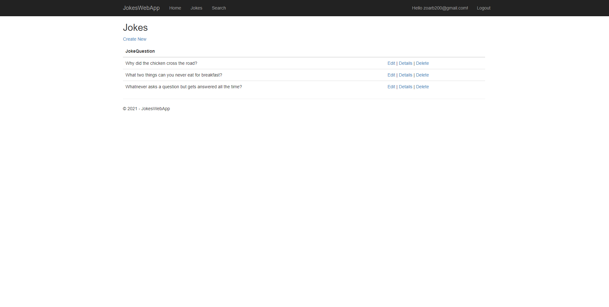
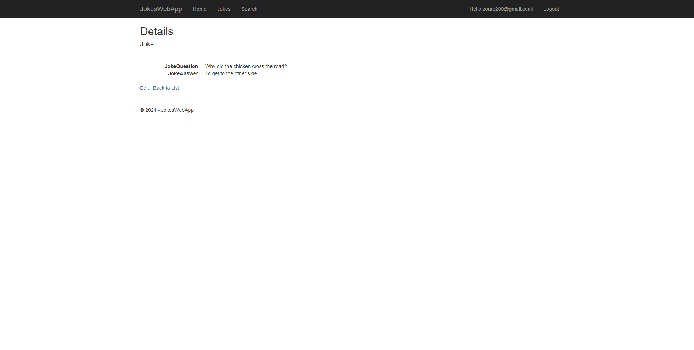
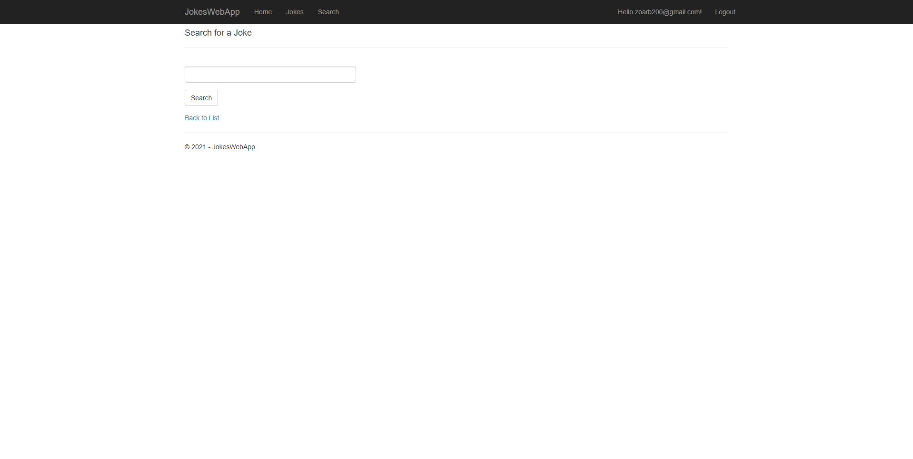
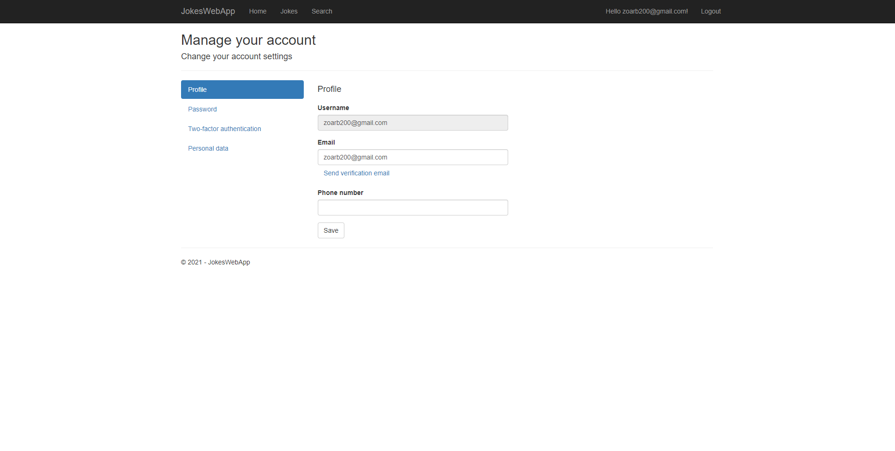

# jokes-app
>Build for learning purposes, MVC. Build with C#

## Technologies & Tools

### Front-end:

- Razor
- HTML
- Bootstrap

### Backend:

- C#
- mySQL

## Features

 - register and login users. 
 - Edit profile and delete.
 - CRUD for joke.
 - Authorization.

### Run

1. Clone the repository.
2. Open with Visual Studio.
3. Click start IIS Express.
